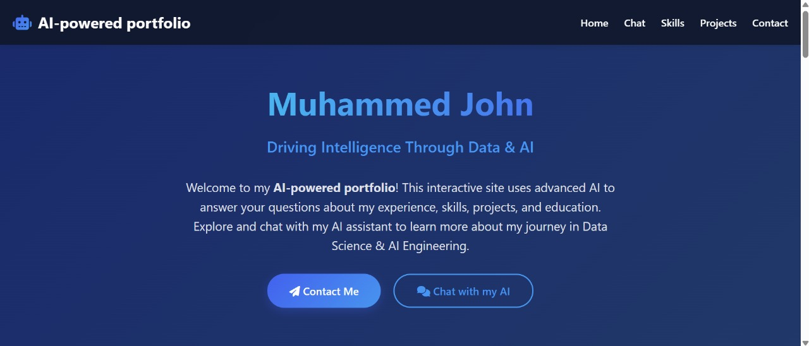

# Portfolio RAG System


This project implements a locally deployable Retrieval-Augmented Generation (RAG) system for Muhammed John's portfolio. It features:
- **Ollama** (Llama3.2 for response generation, mxbai-embed-large for embeddings)
- **FAISS** for semantic search
- **Flask** backend API
- **Modern interactive frontend** with data visualizations and chat

---

## Features

- Semantic search over portfolio data
- Context-aware response generation
- Interactive data visualizations:
  - Skills distribution
  - Technology usage
  - Experience timeline
  - Certifications
  - Portfolio word cloud
- Responsive chat interface

---

## Prerequisites

- [Docker](https://www.docker.com/get-started)
- [Ollama](https://ollama.com/) installed and running on your host machine
  - Pull required models: `ollama pull llama3.2` and `ollama pull mxbai-embed-large`

---

## Setup & Deployment

1. **Clone the repository:**
   ```bash
   git clone https://github.com/muhammedjohn/portfolio-rag.git
   cd portfolio-rag
   ```

2. **Build the Docker image:**
   ```bash
   docker build -t portfolio-rag .
   ```

3. **Run Ollama on your host machine:**
   - Make sure Ollama is running and the required models are pulled.

4. **Run the Docker container:**
   ```bash
   docker run -d -p 5000:5000 --name portfolio-rag portfolio-rag
   ```

5. **Access the app:**
   - Open your browser and go to `http://localhost:5000`
   - Or open `frontend/index.html` directly for the UI

---

## Remote Deployment (Other Devices)

1. **Install Docker** on the target device
2. **Pull the image from Docker Hub:**
   ```bash
   docker pull muhammedjohn/portfolio-rag:latest
   ```
3. **Run Ollama on the host machine** (not inside Docker)
4. **Run the container:**
   ```bash
   docker run -d -p 5000:5000 --name portfolio-rag muhammedjohn/portfolio-rag:latest
   ```
5. **Access the app:**
   - Go to `http://localhost:5000`

---

## Usage

1. The system will automatically:
   - Load or create FAISS index on first run
   - Start the Flask API on port 5000
   - Serve the frontend interface
   - Connect to Ollama running on your host at `http://host.docker.internal:11434`

2. Ask questions about:
   - Education background
   - Technical skills
   - Projects
   - Certifications
   - Professional experience
   - Career goals

---

## Project Structure

```
backend/
  app.py
  rag_utils.py
  requirements.txt
  portfolio.csv
  embeddings.faiss
frontend/
  index.html
  styles.css
  static/
    styles.css
    JS/
      script.js
.gitignore
Dockerfile
README.md
```

---

## Contact

- Email: muhammedjohn3@gmail.com
- LinkedIn: [Maha-Jr](https://www.linkedin.com/in/Maha-Jr/)
- GitHub: [maha-jr10](https://github.com/maha-jr10)
- Kaggle: [muhammedjohn](https://www.kaggle.com/muhammedjohn)

---

## License

MIT License
```

**10. `.gitignore`**
```gitignore
# Python
__pycache__/
*.pyc
*.pyo
*.pyd
.python-version

# Environment variables
.env
.venv
env/
venv/
ENV/

# Data files
*.csv
*.faiss
*.index

# Node
node_modules/

# Frontend build
dist/
build/

# Docker
docker-compose.yml
Dockerfile

# IDE
.vscode/
.idea/
```

### Setup Instructions

1. Create the project structure with all files
2. Build the Docker image:
```bash
docker build -t portfolio-rag .
```
3. Run the container:
```bash
docker run -d -p 5000:5000 --name portfolio-rag portfolio-rag
```
4. Open `frontend/index.html` in your browser

The system will:
1. Initialize the FAISS index on first run
2. Start the Flask backend
3. Load Llama3.2 via Ollama
4. Serve the interactive frontend with visualizations
5. Enable Q&A about your portfolio via the RAG system

This complete implementation provides a professional portfolio showcase with AI-powered Q&A capabilities, data visualizations, and a modern UI - all running locally on your machine.